                                                         Kaua Morera Baldin

- Sou estudante de Desenvolvimento de Sistemas no Centro Universitário da Serra Gaúcha (FSG), na modalidade EAD, com interesse em desenvolvimento de software e familiaridade com Programação Orientada a Objetos, Estruturas de Dados e Lógica de Programação. Durante a graduação, venho desenvolvendo conhecimentos em Algoritmos e Programação, Engenharia de Software, Gestão Ágil de Projetos, Redes de Computadores e desenvolvimento de aplicações, buscando aprimorar minha capacidade de criar soluções tecnológicas eficientes para diferentes necessidades.

- Atualmente, trabalho na área de Tecnologia da Informação, atuando com o ERP TOTVS Protheus no desenvolvimento e customização de soluções para atender às necessidades do negócio. Minha atuação envolve desenvolvimento em ADVPL e TLPP, consultas e manipulação de dados com SQL, manutenção e evolução de rotinas do sistema, criação e ajustes de relatórios e integração entre diferentes processos do ERP.

- Na área de tecnologia, possuo conhecimentos em ADVPL, TLPP, Angular, PO UI, MySQL, JavaScript, HTML e CSS, além de experiência com projetos acadêmicos e pessoais, automação de tarefas, análise de dados e desenvolvimento de sistemas.

<!-- 

  

 -->

## 💻 Minha Stack:

### 👨‍💻 Linguagens de Programação

  
  
  

**ADVPL** • **TLPP** • **PRW**

### ⚙️ Frameworks e Bibliotecas

  

**PO UI**

### 🗄️ Bancos de Dados

  
  

**SQL**

### 🧰 IDEs e Ambientes de Desenvolvimento

  

### 🔀 Controle de Versão e Colaboração

  
  

---

## 📫 Contatos

  
  

---

## 📊 GitHub Stats

  
  

---
